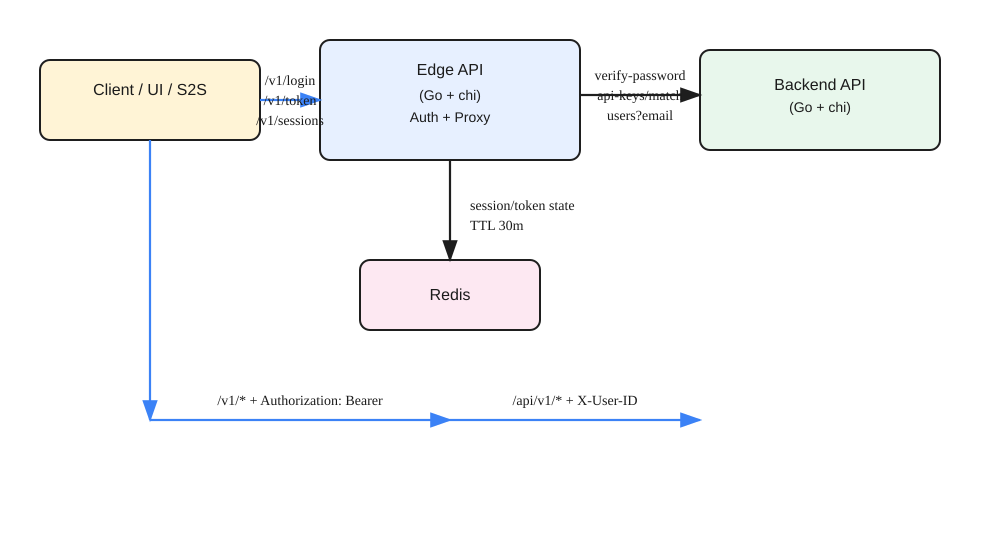

# Edge Service

This service provides authentication, session management, and a transparent proxy to backend services. It verifies auth tokens via Redis, injects `X-User-ID` headers, and forwards requests without altering payloads.

## Architecture



## Quick Start

1. Update config in `config/default.toml`
2. Run:

```bash
go run ./cmd/api
```

## Configuration

File: `config/default.toml`

```toml
[App]
Env = "dev"
ServiceName = "edge"
Host = "127.0.0.1"
Port = "8081"

[Redis]
Host = "127.0.0.1"
Port = "6379"
Password = ""
DB = 0

[BackendServices]
backend_service = "http://127.0.0.1:8080"
```

`BackendServices` is a map of service name -> base URL. The route map chooses which service to call.

## Authentication

All protected routes require:

```
Authorization: Bearer <token>
```

The token is validated in Redis. If valid, the proxy injects:

```
X-User-ID: <user_id>
```

### Session Limit

Max 3 active sessions per user. The limit applies to:
- `/v1/login`
- `/v1/token`

## Redis Keys

Sessions are stored with a 30-minute TTL:

- `auth:sessions:<user_id>` (SET of session IDs)
- `auth:session:<session_id>` -> `<api_token>`
- `auth:token:<api_token>` -> hash: `user_id`, `session_id`

## Auth Endpoints (Edge)

Base: `/v1`

### 1. Login
`POST /v1/login`

Request:
```json
{"username":"<id_or_email>","password":"<password>"}
```

Response:
```json
{"user_id":"...","session_id":"...","api_token":"...","expires_in":1800}
```

### 2. Logout
`POST /v1/logout`

Request:
```json
{"api_token":"..."}
```

Response: `204 No Content`

### 3. List Sessions
`POST /v1/sessions`

Request:
```json
{"username":"<id_or_email>","password":"<password>"}
```

Response:
```json
{"session_ids":["...","..."]}
```

### 4. Expire Session
`POST /v1/sessions/expire`

Request:
```json
{"session_id":"..."}
```

Response: `204 No Content`

### 5. Get Token (S2S)
`POST /v1/token`

Request:
```json
{"api_key":"<api_key>"}
```

Response:
```json
{"token":"...","session_id":"...","expires_in":1800}
```

## Proxy Routes

All backend routes are exposed under `/v1/...` and forwarded to backend `/api/v1/...`.

Requests and responses are passed through without modification.

Auth is enforced per-route via the route config map. `POST /v1/users` is `AuthNone` (signup).

### Route Map

Route config is defined in:
- `internal/edge_service/routes.go`

Each entry contains:
- `Method`: HTTP method
- `AuthType`: `token` or `none`
- `Service`: backend service name from `BackendServices`
- `BackendPath`: backend endpoint path (e.g. `/api/v1/contacts/{contactID}`)

## Backend Integration

The edge uses backend endpoints:
- `POST /api/v1/users/verify-password`
- `POST /api/v1/users/api-keys/match`
- `GET /api/v1/users?email=...`

## Files of Interest

- `cmd/api/main.go` – bootstrap and DI
- `internal/edge_service` – handlers, services, routes
- `packages/redis` – Redis helpers
- `packages/httpRequest` – HTTP client helper for backend calls
